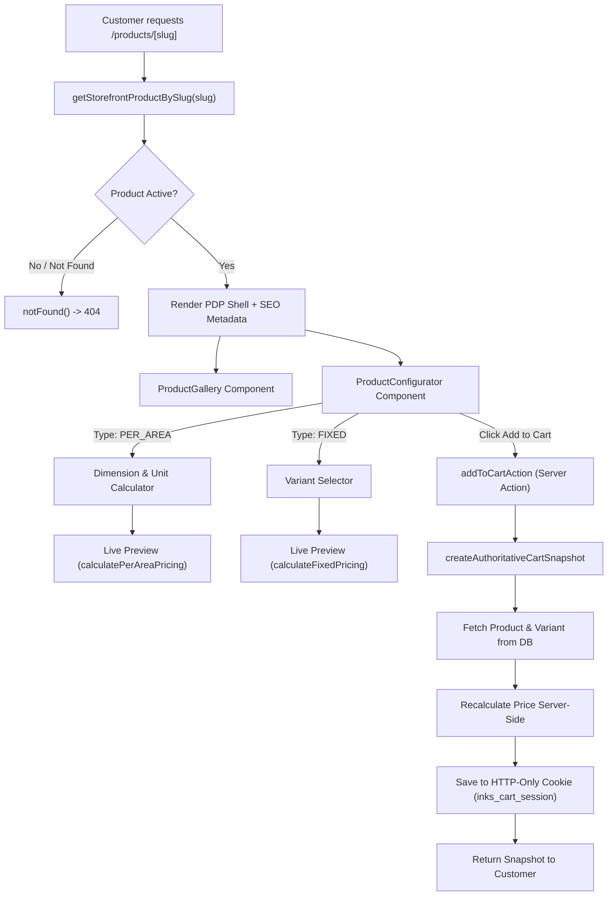

# Product Detail Page (PDP) & Canonical Pricing Architecture

## Overview

Micro-Phase 05.03 implements the complete, customer-facing Product Detail Page (PDP) and interactive Product Configuration experience for **INKs & Walls**. Customers can view high-resolution media galleries, enter custom wall measurements for `PER_AREA` made-to-order wallpapers and acoustic murals, inspect live transparent pricing breakdowns (entered area, wastage allowance, minimum billable area floors, and base rate), choose framing and dimension variants for `FIXED` wall art, and add authoritative configuration snapshots directly to their cart.

---

## Route Structure

| Route | Type | Description |
|---|---|---|
| `/products/[slug]` | Server Component | Canonical Product Detail Page (PDP) resolving active products by URL slug. |
| `/products/[slug]/loading` | React Server Component | Accessible skeleton loader matching gallery and configurator layouts. |
| `/products/[slug]/error` | Client Component | Route error boundary with retry triggers and catalogue fallbacks. |
| `/cart` | Server Component | Cart boundary displaying active cart line snapshots and order subtotal. |

---

## Architecture & Components



### 1. Data Query Layer
Located at [`src/lib/storefront/catalog-service.ts`](file:///Users/naveenadicharla/Documents/Inksandwalls/src/lib/storefront/catalog-service.ts):
- **Function**: `getStorefrontProductBySlug(slug: string): Promise<StorefrontProductDetail | null>`
- **Visibility Guards**: Strictly filters `isActive: true`. Draft, archived, or inactive products are never returned.
- **Media Ordering**: Media items are queried in a single query sorted by `isPrimary: "desc"`, `sortOrder: "asc"`, `createdAt: "asc"`. Eliminates N+1 queries.
- **Variant Filtering**: Strictly loads active variants (`isActive: true`) sorted by `sortOrder: "asc"`.

### 2. Media Presentation
Located at [`src/components/storefront/product-gallery.tsx`](file:///Users/naveenadicharla/Documents/Inksandwalls/src/components/storefront/product-gallery.tsx):
- Primary image view using `<OptimizedImage>` with Cloudflare R2 loader.
- Stored administrator alt text is strictly used (no AI generation or overwriting).
- Interactive thumbnail strip supporting keyboard navigation, arrow keys, and active focus rings.
- Badges indicating custom-cut made-to-order status and return policy.

---

## Canonical Pricing Engine

Located at [`src/lib/pricing/pricing-engine.ts`](file:///Users/naveenadicharla/Documents/Inksandwalls/src/lib/pricing/pricing-engine.ts).
A pure, dependency-free TypeScript module used across PDP client preview, server validation, cart line snapshots, and future order checkout.

### Unit Normalisation
Measurements are normalized to standard feet (`ft`) and square feet (`sqft`):
- `ft`: $1\text{ ft} = 1\text{ ft}$
- `inch`: $1\text{ ft} = 12\text{ inches} \implies \text{widthFt} = \frac{\text{width}}{12}$
- `cm`: $1\text{ ft} = 30.48\text{ cm} \implies \text{widthFt} = \frac{\text{width}}{30.48}$
- `mm`: $1\text{ ft} = 304.8\text{ mm} \implies \text{widthFt} = \frac{\text{width}}{304.8}$

### Mathematical Formula: `PER_AREA` Products

1. **Raw Entered Area**:
   $$\text{enteredAreaSqft} = \text{widthFt} \times \text{heightFt}$$
2. **Wastage Buffer**:
   $$\text{wastageAreaSqft} = \text{enteredAreaSqft} \times \frac{\text{wastagePct}}{100}$$
   $$\text{areaWithWastageSqft} = \text{enteredAreaSqft} + \text{wastageAreaSqft}$$
3. **Minimum Billable Floor**:
   $$\text{billableAreaSqft} = \max(\text{areaWithWastageSqft}, \text{minAreaSqft})$$
4. **Unit Price (in paise)**:
   $$\text{unitPricePaise} = \text{round}(\text{billableAreaSqft} \times \text{ratePaise})$$
5. **Total Configuration Price (in paise)**:
   $$\text{totalPricePaise} = \text{unitPricePaise} \times \text{quantity}$$

### Mathematical Formula: `FIXED` Products

1. **Unit Price**:
   $$\text{unitPricePaise} = \text{selectedVariant.price} \parallel \text{product.basePrice}$$
2. **Total Price**:
   $$\text{totalPricePaise} = \text{unitPricePaise} \times \text{quantity}$$

---

## Authoritative Cart Boundary & Snapshots

Located at [`src/lib/cart/cart-boundary.ts`](file:///Users/naveenadicharla/Documents/Inksandwalls/src/lib/cart/cart-boundary.ts).

### Server-Authoritative Security Guard
- **Zero Trust**: Client-supplied rates, prices, areas, or subtotals are never trusted or stored.
- The client submits only configuration choices (`productId`, `width`, `height`, `unit`, `variantId`, `quantity`).
- The server loads the database record, checks `isActive === true`, validates input dimensions, validates variant ownership, and performs recalculation through `calculatePerAreaPricing` or `calculateFixedPricing`.

### Cart Line Snapshot Schema
Each line added to cart captures an immutable snapshot:

```typescript
interface CartLineSnapshot {
  id: string;
  productId: string;
  productName: string;
  productSlug: string;
  productType: "PER_AREA" | "FIXED";
  primaryMediaKey: string | null;
  categoryName: string | null;
  returnable: boolean;
  hsnCode: string | null;

  // FIXED variant details
  variantId?: string | null;
  variantName?: string | null;
  sku?: string | null;

  // PER_AREA dimension details
  dimensions?: {
    width: number;
    height: number;
    unit: "ft" | "inch" | "cm" | "mm";
    widthFt: number;
    heightFt: number;
  };
  area?: {
    enteredAreaSqft: number;
    wastagePct: number;
    wastageAreaSqft: number;
    areaWithWastageSqft: number;
    minAreaSqft: number;
    isMinAreaApplied: boolean;
    billableAreaSqft: number;
    rollWidthFt: number | null;
    panelsNeeded: number | null;
  };
  ratePaise?: number; // Minor units (paise) per sqft

  unitPricePaise: number;
  quantity: number;
  totalPricePaise: number;
  addedAt: string; // ISO 8601
}
```

### Persistence
The cart session is stored in an HTTP-only, secure cookie named `inks_cart_session` (`SameSite=Lax`, 30-day max age). When Phase 06 introduces full database cart persistence, it will consume this identical snapshot contract.

---

## SEO & Accessibility

1. **Dynamic Metadata (`generateMetadata`)**:
   - Title: `${product.name} | INKs & Walls`
   - Description from actual product record description.
   - Canonical URL: `/products/${product.slug}`
   - OpenGraph preview with primary image R2 endpoint.
2. **Semantic Hierarchy**:
   - Single `<h1>` per page for product title.
   - Distinct `<h2>` for sections ("Custom Size & Pricing Calculator", "Product Specifications").
3. **Accessibility**:
   - `aria-live="polite"` on price updates.
   - Clear input `<label>`s associated with `htmlFor`.
   - Keyboard accessible gallery thumbnails and variant options.
   - High contrast buttons and error alerts.
